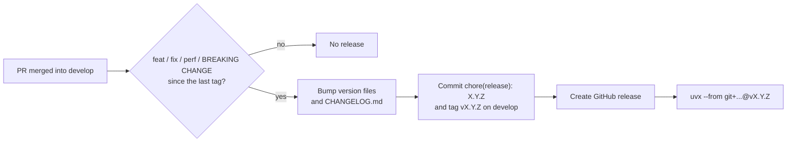

# Release Process

## Why

`pyopenapi-gen` is a generation-time tool: generated clients never import it, so there is nothing to install into an application at runtime. That means a release only needs to be an immutable, addressable point in git history. Running the generator straight from GitHub with [`uvx`](https://docs.astral.sh/uv/guides/tools/) removes the need for a package index, publishing credentials, promotion branches, and the back-merges that kept those branches in sync.

## What

`develop` is the default branch and the only long-lived branch:

- Every pull request targets `develop`, and all CI runs against it.
- Every merge into `develop` runs `.github/workflows/semantic-release.yml`, which cuts a release when there are release-worthy commits since the last tag.
- A release is a `vX.Y.Z` git tag plus a GitHub release with notes. Nothing is built or uploaded anywhere.



### Commit prefixes decide the version

Releases are driven entirely by [Conventional Commits](https://www.conventionalcommits.org/):

| Commit                            | Release               |
| --------------------------------- | --------------------- |
| `fix:` / `perf:`                  | Patch (5.1.12 → 5.1.13) |
| `feat:`                           | Minor (5.1.12 → 5.2.0)  |
| `BREAKING CHANGE:` in the body    | Major (5.1.12 → 6.0.0)  |
| `docs:`, `test:`, `chore:`, etc.  | No release            |

Never write `chore(release):` commits by hand. That prefix is reserved for the release commit, and the workflow skips any push whose head commit uses it.

### What the release workflow changes

`semantic-release version` does all of the work in one step:

1. Computes the next version from the commits since the last `v*` tag.
2. Updates the version in `pyproject.toml` (`project.version` and `tool.commitizen.version`) and in `src/pyopenapi_gen/__init__.py` (`__version__`).
3. Adds an entry to `CHANGELOG.md`.
4. Commits `chore(release): X.Y.Z` and tags it `vX.Y.Z`.
5. Pushes the commit and tag to `develop`.
6. Creates the GitHub release from the changelog entry.

Because the release commit lands directly on `develop`, there is no other branch to sync.

## How

### Running a release

```bash
# Pinned to a release tag (recommended)
uvx --from git+https://github.com/jeffmay/pyopenapi_gen@v5.1.12 pyopenapi-gen openapi.yaml \
  --project-root . \
  --output-package my_api_client

# Unreleased changes on develop, or any other branch
uvx --refresh --from git+https://github.com/jeffmay/pyopenapi_gen@develop pyopenapi-gen --help
```

`uv` caches the tool environment, so pass `--refresh` when using a branch name to make sure the newest commit is picked up. Tags never move, so a pinned tag doesn't need it.

To use the programmatic API, add the generator as a git dependency instead:

```bash
uv add git+https://github.com/jeffmay/pyopenapi_gen --tag v5.1.12
poetry add git+https://github.com/jeffmay/pyopenapi_gen.git#v5.1.12
```

### Configuration

The release branch is set in `pyproject.toml`:

```toml
[tool.semantic_release]
version_toml = ["pyproject.toml:project.version", "pyproject.toml:tool.commitizen.version"]
version_variables = [
    "src/pyopenapi_gen/__init__.py:__version__"
]
commit_message = "chore(release): {version}"
commit_parser = "conventional"
major_on_zero = false

[tool.semantic_release.branches.develop]
match = "^develop$"
```

To move releases to a different branch later, change the `match` above and the `branches:` filters in `ci.yml`, `pr-checks.yml`, and `semantic-release.yml`.

### Required secret

`SEMANTIC_RELEASE_TOKEN` is a repository secret holding a fine-grained personal access token or GitHub App token with **Contents: write**. The workflow pushes the release commit and tag straight to `develop`, so the identity behind that token must be allowed to bypass `develop`'s pull request requirement (see [Branch Protection](../.github/BRANCH_PROTECTION.md)). Without the secret the workflow falls back to `GITHUB_TOKEN`, which can only push if `develop` accepts direct pushes from GitHub Actions.

### One-time setup: tags must exist on the remote

semantic-release finds the previous release by looking for `v*` tags in `develop`'s history. If none are present it starts from `0.0.0` and the next release would be `v1.0.0`. Make sure the existing release tags are on the remote before the first release runs:

```bash
git tag -l 'v*' | grep -v dev | xargs git push origin
```

### Manual release

```bash
gh workflow run semantic-release.yml --ref develop
```

### Checking release status

```bash
gh run list --workflow=semantic-release.yml
gh release list --limit 5
git fetch --tags && git tag --sort=-v:refname | head -5
```

### Troubleshooting

- **No new version after a merge**: check that at least one commit since the last tag uses `feat:`, `fix:`, `perf:`, or a `BREAKING CHANGE:` footer.
- **`branch '...' isn't in any release groups`**: the workflow ran on a branch other than `develop`. Releases only come from the branch matched in `[tool.semantic_release.branches]`.
- **`GH006: Protected branch update failed`**: the token behind `SEMANTIC_RELEASE_TOKEN` isn't allowed to push directly to `develop`.
- **First release jumped to `v1.0.0`**: the remote had no `v*` tags. See the one-time setup above.
